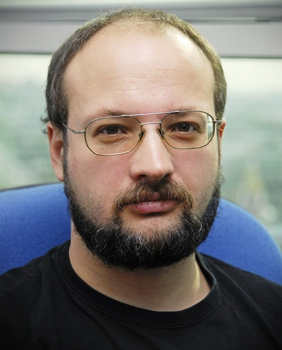

# Sergey Kornienko
_____

Moscow, Russia

Mobile phone: +7(916) xxx-xxxx

E-mail: yyyy@xxx.com

Age: 47

_______

## Education

* **National Research Nuclear University MEPhI (former Moscow Engineering Physics Institute)**
1992-1998, Theoretical & Experimental Physics Faculty, Plasma physics department. Magister, Engineer-physicist. 
* **Rolling Scopes School** 2021 FE stage 0
* **Foxmined**, 2021 JAVA Start 

________

## Summary

*Software Development*  - Junior Java/Front-End Developer with very basic skills. In previous life used basic software development knowledge to add some automations into daily business processes.

*Not Software Development* - Professional with a 21 years of experience in purchasing, product marketing and in partner channel marketing. Worked in largest Russian OEM, Distribution and Retail companies and in multinational corporation (IT hardware manufacturer) with different kinds of product categories - PCs, Laptops, PC Components, Displays, Printing devices, Consumables, Consumer networking products, Storage products. Was responsible for product assortment management, product/price strategy, demand planning, sales, advertising and marketing. 

## Software Development Experience

* Paleoprogramming - Turbo Pascal, Borland Pascal back in 1980s. Modeling of physics processes, creation of own interface libraries.
* VBA - Excel operations automations with VBA, several tools created for cross functional teams - Depositary , Customer MDF letters automation 
* [Codewars solution examples](https://www.codewars.com/users/madkorney/completed_solutions)
* [Advent of Code 2021, 5 stars](https://adventofcode.com/2021#)
* [RS School FE Stage 0 (preschool) - Memory Game](https://rolling-scopes-school.github.io/madkorney-JSFEPRESCHOOL/memory-game/)  
_____

## Employment History

### Western Digital (multinational Storage hardware manufacturer, wdc.com)

- **2015-10 to 2021-10 Channel Marketing Manager, EMEA EAST.**
Managed WD and Sandisk products promotions with Channel Partners in Russia and CIS. Developed GTM campaigns, partners’ activities and managed regional marketing budgets and activities to support Sales Team in achieving sales targets. 
 
- **2012-09 to 2015-09 Regional Marketing Manager, EMEA EAST**
Managed WD Retail product portfolio in Russia, CIS and Eastern Europe. Developed local product promotion strategy, delivered localized product content to the Sales team and channel partners. Conducted product trainings and presentations for colleagues, partners, press. 
 
### Pirit (wholesale distribution, acquired by Treolan, treolan.ru)

- **2010-09 to 2012-08 Product manager (HP Laptops).**
Managed purchases of HP Consumer Laptops. Negotiated and synchronized internal planning with vendor planning. Successfully met both internal and vendor targets. Improved stock rotation by 100%, Y/Y revenue growth 42% in 2011 and 59% for 2012H1 versus planned 27% growth. 
 
### Eldorado(retail, eldorado.ru)
- **2007-09 to 2010-08 Buyer**
Managed several product categories: Displays, Printing devices, Consumables, PC peripherals (networking, retail HDD, optical drives etc.). Full category management to meet given volume and margin plans and market shares including merchandising, advertising, promo campaigns, new product launches. 
 
### Merlion (wholesale distribution, merlion.com)
- **2003-04 to 2007-08 Product Manager (GPU)**
Branded graphics cards product line management (Asus, Gigabyte, MSI, Sapphire, Palit, Sparkle and others). Managed product mix and price policy. Joint revenue and margin planning with sales team. Performed NPI events and channel marketing promotions with GPU makers. Company market share increased from 25% to 30%, margin improved up to 15%, on flat/shrinking market avoided revenue drop, increased ASP ahead of market trends.
 
### AIRTON (wholesale distribution, R.&K. Group)
- **2001-09 to 2003-03 Product Manager (motherboards and VGA)**
Branded VGA and Motherboards product lines management in Distribution channel (Asus, Gigabyte, DFI, MSI). Sales growth around four times during two years 

### R.&K. (PC maker, R.&K. Group) 
- **2000-02 to 2001-08 Product Manager (PCs)**
Developed own branded PC product line (product mix, price policy, NPI events, production control) 
 
- **1999-07 to 2000-01 Pre-Sales Technical Consulting Specialist**

### Onyx (PC TV shop)
- **1999-01 to 1999-06 Field Engineer, installing PC at consumers**

### Interprogressbank (bank, ipb.ru)
- **1997-04 to 1998-12 Analytic and Trader , bonds/stocks spot markets.**

## Skills 

Strong analytical skills, good presentation skills. 
Expert in MS Excel, advanced skills in other MS Office products and internet/graphics software.

## Language Skills 
- **Russian** - Native 
- **English** - C1 Advanced